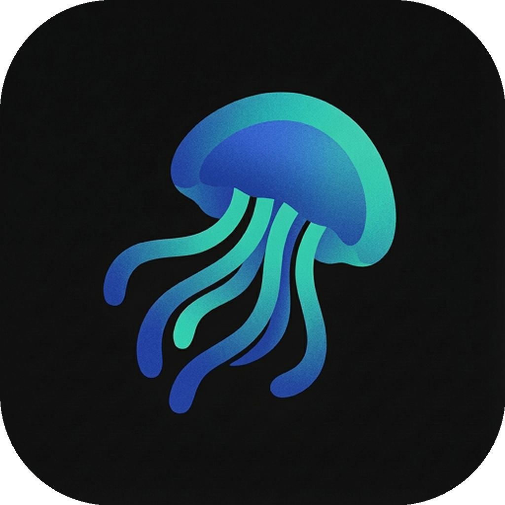
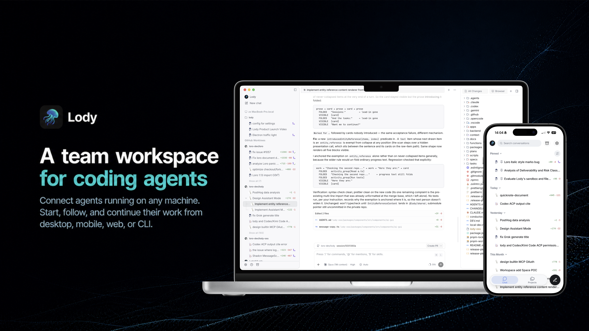
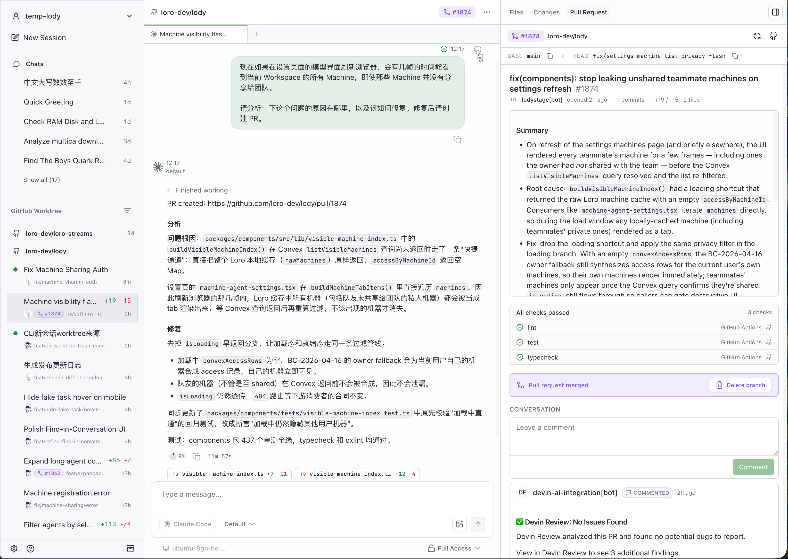
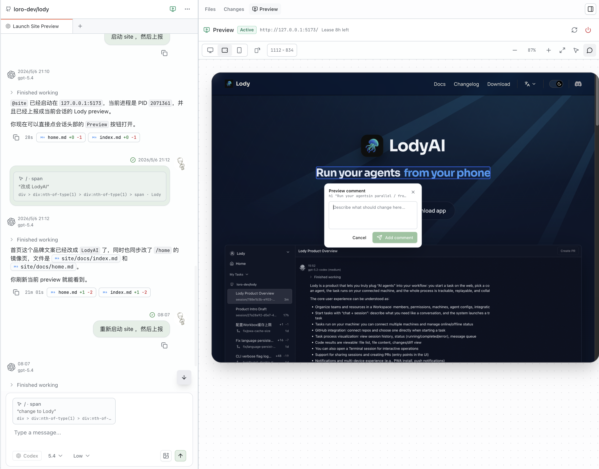
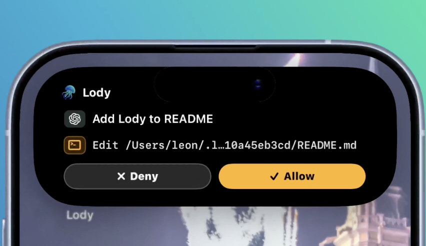

<p align="center">
    <a href="https://play.google.com/store/apps/details?id=ai.lody.android">
        
    </a>
    <a href="https://apps.apple.com/us/app/lody-run-code-agent-anywhere/id6761373528">
        
    </a>
    <a href="https://lody.ai/download">
        
    </a>
    <a href="https://lody.ai/download">
        
    </a>
    <a href="https://lody.ai/download">
        
    </a>
</p>

<p align="center">
  <a href="https://lody.ai">
    <picture>
      
    </picture>
  </a>
</p>
<h1 align="center">
<a href="https://lody.ai" alt="lody-site">Lody</a>
</h1>
<p align="center">
  <b>English</b> | <a href="./README.zh-CN.md">简体中文</a>
</p>
<p align="center">
  <b>A shared workspace for the coding agents your team already uses.</b>
</p>
<p align="center">
  Connect any machine and bring any coding agent through ACP. Share conversations with your team and dispatch work from desktop, mobile, web, or CLI.
</p>
<p align="center">
  <a href="https://lody.ai/docs/">
    <b>Documentation</b>
  </a>
  |
  <a href="https://lody.ai/docs/quickstart">
    <b>Getting Started</b>
  </a>
</p>
<p align="center">
  <a aria-label="X" href="https://x.com/intent/follow?screen_name=lody_ai" target="_blank">
    
  </a>
  <a aria-label="Discord-Link" href="https://discord.gg/E8mZtMu38s" target="_blank">
    
  </a>
</p>

<p align="center">
  
</p>

## What you can do with Lody

### Share Agent conversations with your team

Open the same conversation with your teammates. See the full transcript, runtime status, files, and code changes around the work, then add instructions without passing around screenshots or pasted logs.

### Bring the Agents and machines you already use

Connect Claude Code, Codex, Kimi, OpenCode, or another ACP-compatible Agent. Keep using the subscriptions, logins, models, and permission modes configured on your laptops, workstations, servers, and cloud VMs. Machines remain private until their owner shares them with the workspace.

### Dispatch work from any surface

Choose any connected machine when dispatching work from desktop, mobile, web, or CLI. Permission requests, progress, conversations, and code changes stay visible across these surfaces.

## Connect a machine

Run Lody on a workstation, server, or cloud VM:

```bash
npx lody daemon start
```

The command opens a sign-in link, connects the machine to your workspace, and keeps it available for work dispatched from desktop, mobile, web, or CLI.

## Use Lody from the CLI

The CLI is more than the process that connects a machine. From a terminal or script, you can register local projects; inspect workspaces, machines, linked repositories, and Agent configs; create and message sessions; read their history and status; or archive and restore them. Commands that support `--json` can also feed Lody workspace data into your own tools.

```bash
npx lody session create --workspace my-team --agent-config codex \
  --repo owner/repo "Fix the failing test"

npx lody session list --workspace my-team
```

See the [CLI documentation](https://lody.ai/docs/cli) for the full command reference.

## Let Agents coordinate work across conversations

Lody gives Agents tools to create or reuse other conversations, read their status and history, send follow-up instructions, cancel running work, and bring results back. This lets one conversation act as the coordinator: you can analyze a bug with a main Agent, then have it delegate investigation, implementation, and testing to separate conversations running in parallel.

Lody keeps each child conversation independent while preserving its relationship to the conversation that created it. Conversations can also be referenced with an `@` mention when you or an Agent needs to connect work across sessions.

## Keep code and execution in the same workspace

### Keep parallel work isolated

Give sessions their own Git worktrees so Agents can work in parallel without mixing changes. Open multiple chats, files, diffs, terminals, and previews in tabs, or fork a session into another conversation or worktree to explore a different approach.

### Inspect changes where the work happened

Browse project files and inspect per-turn or full-session diffs beside the conversation. Add line-level comments, follow pull request status and CI, and keep GitHub review threads close to the Agent that produced the change.

<p align="center">
  
</p>

### Give Agents visual feedback

Open a running web app inside the session, switch between responsive viewports, and send element-level visual annotations back to the Agent.

<p align="center">
  
</p>

## More built in

- **Agent Roles** — share reusable Agent, model, permission, and instruction presets with the team.
- **Attachments** — send files and images from desktop, mobile, web, or CLI, and receive files produced by Agents.
- **Session tools** — search, pin, archive, fork, and organize conversations without losing their history.
- **Desktop tools** — use a built-in terminal, command palette, customizable shortcuts, and open files in your editor.
- **Mobile controls** — receive notifications, approve permission requests, inspect diffs, and follow active work with iOS Live Activities.
- **Usage visibility** — see context, token and quota usage, plus machine and Agent resource consumption.

<p align="center">
  
</p>

## Beyond conversations

Shared conversations are Lody's starting point, not the whole workspace.

We plan to add documents and document sandboxes so teams can shape requirements, preserve decisions, and work with Agents outside the timeline of a single conversation. Over time, these tools can become shared team context for understanding not only what changed, but why.

We want the entire workspace—not only conversations—to become local-first. Lody uses the [Loro](https://loro.dev/) Stack, including Loro and Flock, to represent and synchronize collaborative state with CRDTs. The same foundation can extend from conversations to documents and future workspace tools. Our goal is for team context to become more durable and portable, and ultimately remain under the team's control.

Lody is still moving toward full local-first support.

## Repository

- `apps/cli` — Connect machines and run coding agents
- `apps/electron` — Lody desktop app
- `packages/components` — Shared workspace UI
- `packages/platform` — Platform capabilities and integrations
- `packages/shared` — Shared schemas, protocols, and utilities
- `site-docs` — Website, documentation, and blog

See [CONTRIBUTING.md](./CONTRIBUTING.md) to get started with development.
