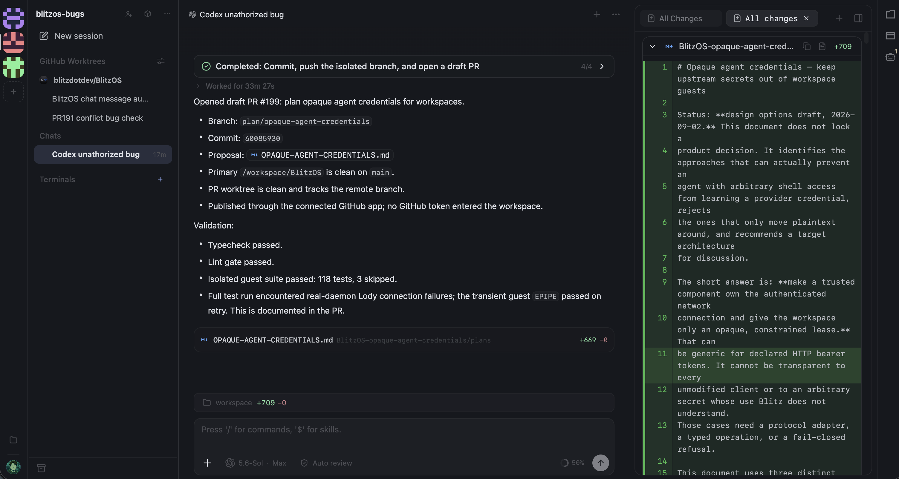

<h1 align="center">BlitzOS</h1>

<p align="center"><strong>Your org's AI Operating System</strong></p>

<p align="center">
  <a href="#features">Features</a> •
  <a href="#architecture">Architecture</a> •
  <a href="#packages">Packages</a>
</p>

<p align="center">
  
</p>

# Features

**BYO agent and use self-hosted machines on any cloud** 

- **Agent workspaces** Shareable, sandboxed cloud computers holding only the credentials and data AI agents need.
- **Workspace templates** Create agent workspace templates defining what repos, credentials, machine environment, etc. are put in the agent workspace. Set up once and share with everyone. 
- **Recipes** Like skills but on steroids: define the runtime of a successful agent workflow (AI model, machine env, data + credentials) and trigger it with a webhook from Slack, GitHub, etc.
- **Teenyapps** Mini apps you can vibe-code to build internal tools like dashboards, CRMs, and task managers — each comes with a backend, auth, and a URL.
- **Automatic Evals** [Experimental] A built-in eval skill that generates evals from aggregated real AI usage data across your org. 

# About 

A computer OS makes you more productive with computers. An AI OS makes you more productive using AI. It does this by providing abstractions for managing the AI's access, context, and working environment. 

An AI OS improves your capability to experiment with AI and spread useful AI workflows. Since AI keeps advancing faster, an org's capability to "digest" AI advancements will become very important. 

BlitzOS helps orgs digest AI advancements as fast as they happen. BlitzOS abstractions like agent workspaces, templates, and recipes help by enabling **faster experimentation** and **workflow sharing**. Also, features like automatic evals can be built on workspaces + templates + recipes to optimize the cost of AI.

# Installation

### Automated agent setup

Paste this prompt into your coding agent:

```text
Self-host BlitzOS from this repo. Read docs/SELF-HOST.md. Follow its steps in order. Ask me for the accounts you need: Cloudflare, a spare domain, Google OAuth, and Hetzner or a Firecracker host.
```

### Manual setup

Follow the [self-host guide](docs/SELF-HOST.md).


# Packages

- [`box`](packages/box/README.md) the complete workspace runtime: SSH, Docker, agent harnesses, terminal, chat, files, and previews.
- [`control-plane`](packages/control-plane/README.md) workspace lifecycle, sessions, access, credential injection, volumes, and compute providers.
- [`microvm-host`](packages/microvm-host/README.md) the Go host agent that runs and networks Firecracker workspaces.
- [`webApp`](packages/webapp/README.md) the browser webApp for creating, configuring, sharing, and working inside workspaces.
- [`broker`](packages/broker/README.md) short-lived Claude and Codex credential delivery for workspace fleets.
- [`schema`](packages/schema/README.md) shared wire types and ACP conformance fixtures.

# Docs

- [Self-host guide](docs/SELF-HOST.md) clone to first workspace, in order.
- [Workspace tunnels](docs/TUNNEL.md) browser access to cloud-VM workspaces.
- [Box image](docs/BOX-IMAGE.md) build, publish, and upgrade the workspace image.
- [Automatic evals](docs/AUTOMATIC-EVALS.md) turn captured agent usage into an eval suite with one recipe.
- [Contributing](CONTRIBUTING.md) the three gates, the lint ratchet, fixtures, commit style.
- [Security](SECURITY.md) reporting, secret blast radius, the workspace trust model.
- Packages: [box](packages/box/README.md) · [control-plane](packages/control-plane/README.md) · [microvm-host](packages/microvm-host/README.md) · [webapp](packages/webapp/README.md) · [broker](packages/broker/README.md) · [schema](packages/schema/README.md)


# Roadmap

- [ ] recipes
- [ ] evals
- [ ] policy

Apache-2.0.
